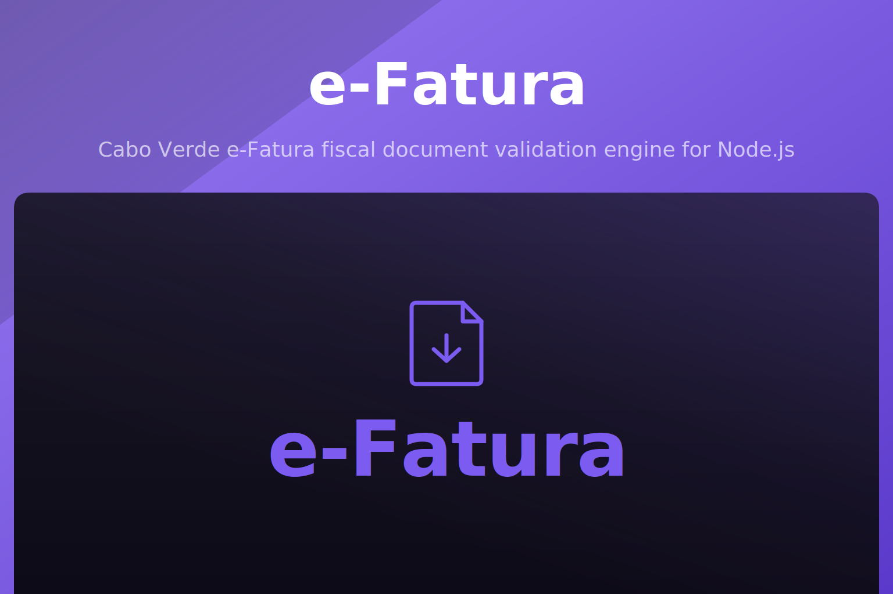

<p align="center">
  
</p>

<p align="center">
  <a href="https://www.npmjs.com/package/@akira-io/efatura"></a>
  <a href="https://www.npmjs.com/package/@akira-io/efatura"></a>
  <a href="https://www.npmjs.com/package/@akira-io/efatura"></a>
  <a href="https://github.com/akira-io/node-efatura/actions/workflows/test.yml"></a>
  
  
  
</p>

> [!WARNING]
> Beta software. The API may change before `1.0.0`. Install with the `beta` tag: `npm install @akira-io/efatura@beta`. Pin an exact version in production and review the [changelog](CHANGELOG.md) before upgrading.

Cabo Verde e-Fatura fiscal document validation engine for Node.js. It provides a framework-agnostic core for validating fiscal documents, generating DFE XML, packaging ZIP payloads, signing with XAdES-BES, and integrating through Express, Fastify, and Nest adapters.

## Install

```sh
# npm
npm install @akira-io/efatura

# pnpm
pnpm add @akira-io/efatura

# yarn
yarn add @akira-io/efatura

# bun
bun add @akira-io/efatura
```

```json
{
  "dependencies": {
    "@akira-io/efatura": "latest"
  }
}
```

Review [CHANGELOG.md](CHANGELOG.md) before upgrading production systems.

## Prisma schema

Copy the sequence model into a Prisma multi-file schema:

```sh
npx @akira-io/efatura prisma
```

The command writes to `prisma/schema/efatura-sequence.prisma` by default. Use `--out` for a custom path, `--print` to inspect or append the model, and `--force` to replace an existing file.

## Quick start

```ts
import { DocumentType, TaxTypeCode, createEfatura } from '@akira-io/efatura';

const efatura = createEfatura({
  transmitterNif: '123456789',
  transmitterLed: '001',
  transmitterKey: process.env.EFATURA_TRANSMITTER_KEY,
  emitter: {
    name: 'Demo Emitter',
    address: {
      countryCode: 'CV',
      addressDetail: 'Praia',
    },
    contacts: {
      email: 'billing@example.com',
      telephone: '2600000',
    },
  },
  softwareCode: 'EFATURA-DEMO',
  softwareName: 'Demo Billing',
  softwareVersion: '1.0.0',
  middlewareBaseUrl: 'https://middleware.example.test',
  dfaBaseUrl: 'https://dfa.example.test',
  environment: 'TEST',
});

const invoice = efatura
  .invoice()
  .type(DocumentType.ElectronicInvoice)
  .issueDate('2026-02-08')
  .receiver({ taxId: { countryCode: 'CV', value: '900800700' }, name: 'Receiver' })
  .line({
    quantity: { value: 1, unitCode: 'EA' },
    price: 1000,
    priceExtension: 1000,
    netTotal: 1000,
    taxes: [{ taxTypeCode: TaxTypeCode.IVA, taxPercentage: 15, taxTotal: 150 }],
    item: {
      description: 'Item',
      emitterIdentification: 'ITEM1',
    },
  })
  .totals({
    priceExtensionTotalAmount: 1000,
    netTotalAmount: 1000,
    taxTotalAmount: 150,
    payableAmount: 1150,
  })
  .validate();

console.log(invoice.id);
```

## Documentation

- [Documentation index](docs/00-index.md)
- [Installation](docs/01-installation.md)
- [Configuration](docs/02-configuration.md)
- [Quick Start](docs/03-quick-start.md)
- [Technical Briefing](docs/04-technical-briefing.md)
- [XML v11](docs/05-xml-v11.md)
- [Validation And Zod](docs/06-validation-zod.md)
- [Packaging](docs/07-packaging.md)
- [Adapters](docs/08-adapters.md)
- [Architecture](docs/10-architecture.md)
- [Compliance Matrix](docs/11-compliance-matrix.md)
- API reference: https://www.npmjs.com/package/@akira-io/efatura

## Testing

```sh
bun run test
```

Live PE/DNRE readiness tests are skipped by default. Enable them with `EFATURA_LIVE_TESTS=1` and the required `EFATURA_LIVE_*` credentials documented in [Configuration](docs/02-configuration.md).

## Changelog

Please see [CHANGELOG.md](CHANGELOG.md) for what has changed recently. The changelog is generated from conventional commits via [git-cliff](https://git-cliff.org) on every release tag.

## Contributing

Please see [CONTRIBUTING.md](CONTRIBUTING.md) for details.

## Security

Please review [our security policy](SECURITY.md) on how to report security vulnerabilities.

## Credits

- [Kidiatoliny](https://github.com/kidiatoliny)
- [All Contributors](https://github.com/akira-io/node-efatura/graphs/contributors)

## License

Dual-licensed under either of the following, at your option:

- MIT License ([LICENSE-MIT](LICENSE-MIT) or https://opensource.org/licenses/MIT)
- Apache License 2.0 ([LICENSE-APACHE](LICENSE-APACHE) or https://www.apache.org/licenses/LICENSE-2.0)

Unless you explicitly state otherwise, any contribution intentionally submitted for inclusion in this project by you, as defined in the Apache-2.0 license, shall be dual-licensed as above, without any additional terms or conditions.
